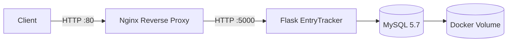
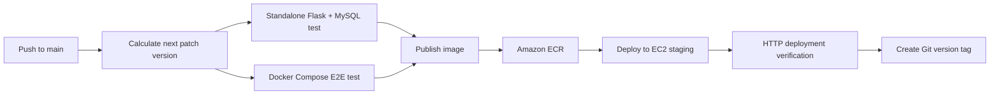

# EntryTracker CI/CD

[](https://github.com/Danielh2525/entrytracker-cicd/actions/workflows/ci.yaml)

EntryTracker is a small Flask + MySQL application built as a DevOps portfolio project. The application records each request with the container hostname, IP address and timestamp, while the repository focuses on the delivery workflow around it: containerization, testing, versioning, image publishing and automated deployment to AWS.

The project demonstrates an end-to-end CI/CD flow using **Docker, Docker Compose, Nginx, GitHub Actions, Amazon ECR and Amazon EC2**.

## What This Project Demonstrates

- Containerization of a Python/Flask application with Docker.
- Multi-container application orchestration with Docker Compose.
- MySQL persistence using a named Docker volume.
- MySQL health checks and startup dependency handling.
- Nginx as a reverse proxy in front of the Flask service.
- Standalone application testing inside GitHub Actions.
- Docker-based end-to-end testing through Nginx.
- Automated Docker image publishing to Amazon ECR.
- Automated deployment to an EC2 staging server over SSH.
- Deployment verification before the pipeline is considered successful.
- Automatic patch-version generation and Git tagging.

## Architecture



The Flask container is not published directly to the host. Nginx is the public entry point and forwards requests to the `web` service on the internal Docker network.

## CI/CD Workflow

Every push to `main` starts the GitHub Actions pipeline.



### Pipeline stages

1. **Version**
   - Reads the latest Git tag matching `vMAJOR.MINOR.PATCH`.
   - Increments the patch number.
   - Exposes the new version as the Docker image tag for later jobs.

2. **Standalone test**
   - Starts a MySQL 5.7 service on the GitHub-hosted runner.
   - Installs the Python dependencies.
   - Starts the Flask application directly.
   - Uses `curl` to verify the application responds successfully.

3. **Docker end-to-end test**
   - Builds the EntryTracker Docker image.
   - Starts Nginx, Flask and MySQL with Docker Compose.
   - Tests the application through Nginx on port 80.
   - Prints container logs on failure and always tears the environment down.
   - Saves the tested Docker image as a GitHub Actions artifact.

4. **Publish**
   - Downloads the image artifact produced by the E2E job.
   - Authenticates to AWS and Amazon ECR.
   - Pushes both the versioned image and the `latest` tag.

5. **Deploy**
   - Copies the production Compose file and Nginx configuration to the EC2 host.
   - Logs the EC2 server into Amazon ECR.
   - Pulls the newly published application image.
   - Recreates the Flask and Nginx containers.
   - Verifies the deployment locally on the EC2 host with `curl`.

6. **Git tag**
   - Creates and pushes the new semantic version tag only after the deployment succeeds.

## Technology Stack

| Area | Technology |
|---|---|
| Application | Python 3.10, Flask |
| Database | MySQL 5.7, PyMySQL |
| Containers | Docker, Docker Compose |
| Reverse proxy | Nginx |
| CI/CD | GitHub Actions |
| Container registry | Amazon ECR |
| Deployment target | Amazon EC2 |
| Versioning | Git tags using `vMAJOR.MINOR.PATCH` |

## Run Locally

### Prerequisites

- Docker
- Docker Compose v2
- Git

### 1. Clone the repository

```bash
git clone https://github.com/Danielh2525/entrytracker-cicd.git
cd entrytracker-cicd
```

### 2. Create the environment file

```bash
cp .env.example .env
```

Example values:

```env
DB_HOST=mysql
DB_USER=root
DB_PASSWORD=example_password
DB_NAME=entrytracker
```

### 3. Start the stack

```bash
docker compose up --build -d
```

### 4. Test the application

```bash
curl http://localhost
```

A successful request returns JSON containing the current request information and the previously stored entries from MySQL.

### 5. Stop the environment

```bash
docker compose down
```

To also delete the local database volume:

```bash
docker compose down -v
```

## AWS Deployment Requirements

The current pipeline deploys to an existing EC2 staging server and publishes images to an existing ECR repository. Infrastructure provisioning is outside the scope of this repository.

The EC2 host must have:

- Docker installed.
- Docker Compose v2 available through `docker compose`.
- AWS CLI installed.
- Network access to Amazon ECR.
- Port 80 allowed by the EC2 security group for application access.
- An application directory matching the `EC2_APP_DIR` GitHub secret.
- A `.env` file in that application directory containing the database variables used by `docker-compose.prod.yaml`.

### Required GitHub Actions secrets

| Secret | Purpose |
|---|---|
| `AWS_ACCESS_KEY_ID` | AWS authentication used by GitHub Actions |
| `AWS_SECRET_ACCESS_KEY` | AWS authentication used by GitHub Actions |
| `AWS_REGION` | AWS region containing ECR and EC2 resources |
| `AWS_ACCOUNT_ID` | AWS account ID used to construct the ECR registry URL |
| `ECR_REPOSITORY` | ECR repository name |
| `EC2_HOST` | Public hostname or IP of the staging server |
| `EC2_USER` | SSH user for the EC2 server |
| `EC2_SSH_KEY` | Private SSH key used by the deployment job |
| `EC2_APP_DIR` | Deployment directory on the EC2 server |

> **Note:** `docker-compose.prod.yaml` currently contains the ECR image URI used by this project. To deploy the repository in another AWS account, update or parameterize that image URI for the target ECR registry/repository.

## Repository Structure

```text
.
├── .github/
│   └── workflows/
│       └── ci.yaml              # CI/CD pipeline
├── .env.example                 # Local environment template
├── Dockerfile                   # Flask application image
├── app.py                       # EntryTracker Flask application
├── docker-compose.yaml          # Local / CI Compose environment
├── docker-compose.prod.yaml     # EC2 deployment Compose file
├── nginx.conf                   # Nginx reverse proxy configuration
├── requirements.txt             # Python dependencies
└── README.md
```

## Reliability Features

- Database persistence through a named Docker volume.
- MySQL health check before the Flask service is started.
- Retry loops for CI and deployment HTTP verification.
- End-to-end testing through the same Nginx entry point used by the deployed stack.
- Pipeline job dependencies prevent publishing or deployment when tests fail.
- Git version tags are created only after a successful deployment.

## Production Hardening Ideas

This project is intentionally kept small enough to make the CI/CD flow easy to inspect. Natural next improvements would include:

- Replace long-lived AWS access keys with GitHub Actions OIDC and an IAM role.
- Replace `StrictHostKeyChecking=no` with managed SSH host verification.
- Parameterize the ECR registry instead of hardcoding an account-specific image URI.
- Add HTTPS/TLS termination.
- Store application secrets in AWS Secrets Manager or SSM Parameter Store.
- Add container/image vulnerability scanning.
- Provision the AWS infrastructure with Terraform.
- Add centralized application and container logging/monitoring.
- Introduce rolling or blue/green deployment instead of recreating containers in place.

## Project Goal

The application itself is deliberately simple. The main goal is to demonstrate the DevOps lifecycle around an application: **build -> test -> package -> publish -> deploy -> verify -> version**.
